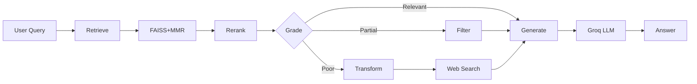

# RAG Project - Learn About Transformers

A production-ready **Corrective Retrieval-Augmented Generation (CRAG)** system built with LangChain, LangGraph, and FastAPI. This project implements an intelligent RAG pipeline that not only retrieves relevant documents but also **validates, corrects, and improves** retrieval quality through an agent-based workflow.

## What Makes This Different from Traditional RAG?

### Traditional RAG:
```
Query → Retrieve Documents → Generate Answer
```
**Problem**: If retrieved documents are irrelevant or low-quality, the answer will be poor.

### This Project (Corrective RAG):
```
Query → Retrieve → Grade Quality → Transform Query if Needed → Web Search if Necessary → Generate
```
**Solution**: Intelligent agent workflow that **self-corrects** by grading document relevance and taking corrective actions.

## Architecture



## Key Features

### 1. **Intelligent Document Grading**
- LLM evaluates retrieved documents for relevance
- Filters out low-quality results automatically
- Ensures only useful context reaches generation

### 2. **Query Transformation**
- Rewrites ambiguous or poor queries
- Improves retrieval on second attempt
- Adaptive query refinement

### 3. **Web Search Fallback**
- Tavily API integration for external knowledge
- Activates when local documents insufficient
- Combines local + web results

### 4. **Advanced Retrieval Stack**
- **FAISS** vector store with MMR search
- **FastEmbed** (BAAI/bge-small-en-v1.5) embeddings
- **FlashRank** (rank-T5-flan) reranking
- Self-query retriever support

### 5. **LangGraph Agent Workflow**
- State machine orchestration
- Conditional routing logic
- Transparent decision-making

## Tech Stack

| Component | Technology |
|-----------|------------|
| **LLM** | Groq (openai/gpt-oss-120b) |
| **Embeddings** | FastEmbed (BAAI/bge-small-en-v1.5) |
| **Vector Store** | FAISS |
| **Reranker** | FlashRank (rank-T5-flan) |
| **Agent Framework** | LangGraph |
| **RAG Framework** | LangChain 0.3.x |
| **Web Search** | Tavily API |
| **Web Framework** | FastAPI + Uvicorn |
| **Observability** | LangSmith (optional) |
| **Document Source** | "Attention Is All You Need" (Transformer paper) |

## Project Structure

```
RAG Project/
├── project/
│   ├── config/
│   │   └── config.yaml              # Model & pipeline configuration
│   ├── logger/
│   │   └── logging.py               # Centralized logging
│   ├── exception/
│   │   └── except.py                # Custom exception handling
│   ├── utils/
│   │   ├── config_loader.py         # YAML config loader
│   │   └── model_loader.py          # LLM & embedding initialization
│   ├── source/
│   │   └── data_preparation.py      # PDF/ArXiv document loading
│   ├── model/
│   │   ├── retriever.py             # FAISS retriever with MMR
│   │   └── reranking.py             # FlashRank reranking
│   ├── prompts/
│   │   └── prompt_template.py       # RAG, Router, WebSearch prompts
│   └── pipeline/
│       ├── rag.py                   # Core RAG pipeline
│       └── agents.py                # CRAG agent workflow
├── templates/
│   └── index.html                   # Web UI template
├── static/
│   └── styles.css                   # Purple gradient theme
├── data/
│   └── attention-is-all-you-need.pdf
├── app.py                           # FastAPI application
├── main.py                          # CLI entry point
├── Dockerfile                       # Docker containerization
└── requirements.txt                 # Dependencies

```

## Quick Start

### 1. Clone & Install
```bash
git clone https://github.com/Abeshith/RAG-Project-PipeLine.git
cd RAG-Project-PipeLine
pip install -r requirements.txt
```

### 2. Set Environment Variables
Create `.env` file:
```env
GROQ_API_KEY=your_groq_api_key
GOOGLE_API_KEY=your_google_api_key
LANGSMITH_API_KEY=your_langsmith_key  
TAVILY_API_KEY=your_tavily_key        
```

### 3. Run Web Interface
```bash
python app.py
```
Visit: http://localhost:8000

### 4. Run CLI
```bash
python main.py
```

## Docker Deployment

### Build & Run
```bash
docker build -t rag-project .
docker run -d -p 8000:8000 --env-file .env rag-project
```

## How It Works

### Workflow Example

**Query**: "What is the attention mechanism in transformers?"

1. **Retrieval**: FAISS finds top 3 most similar chunks from "Attention Is All You Need" paper
2. **Reranking**: FlashRank reorders by relevance (top 3 kept)
3. **Grading**: LLM evaluates each document: 
   - ✅ Doc 1: Relevant (explains attention)
   - ✅ Doc 2: Relevant (shows formula)
   - ❌ Doc 3: Not relevant (talks about training data)
4. **Decision**: 2/3 relevant → Use filtered docs
5. **Generation**: Groq LLM synthesizes answer from relevant docs
6. **Output**: Comprehensive answer with LaTeX formulas (rendered via MathJax)

### When Retrieval Fails

**Query**: "What are the latest improvements to transformers in 2024?"

1. **Retrieval**: Finds documents from 2017 paper
2. **Grading**: ❌ All documents marked "not relevant" (outdated info)
3. **Transform**: Rewrites query → "Recent transformer architecture improvements 2024"
4. **Web Search**: Tavily searches current web content
5. **Generation**: Answer combines paper fundamentals + recent developments

## Web Interface Features

- **Modern UI**: Purple gradient design with responsive layout
- **MathJax Integration**: Renders LaTeX formulas beautifully
- **Transformer Visualization**: Architecture diagram in header
- **Real-time Search**: Fast async FastAPI backend
- **Error Handling**: Graceful degradation with user-friendly messages
